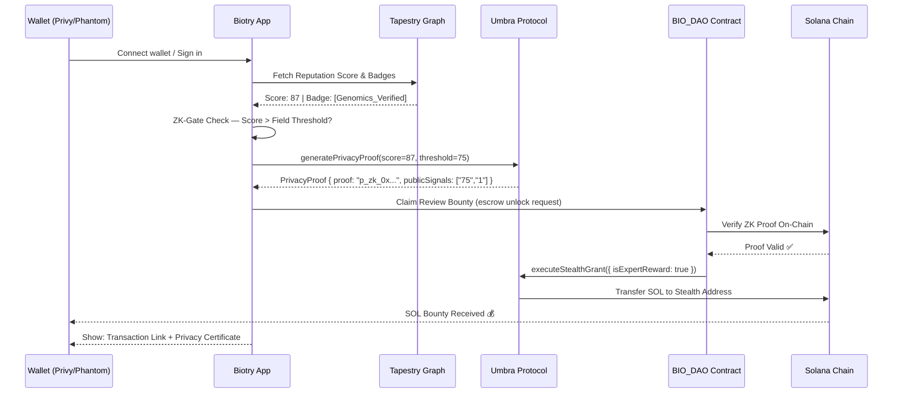
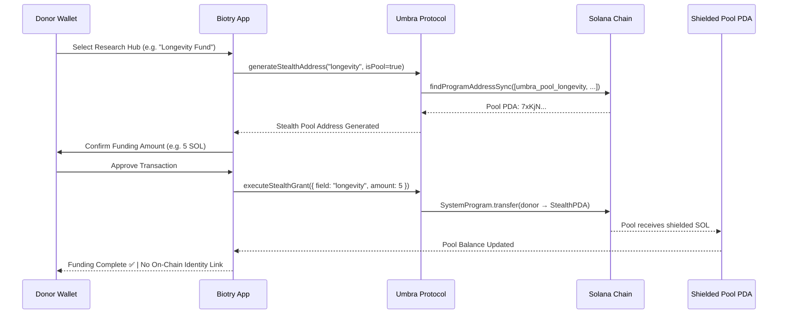
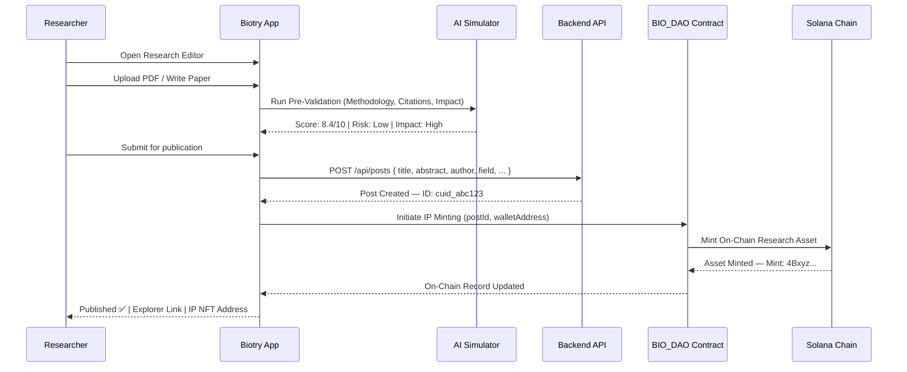
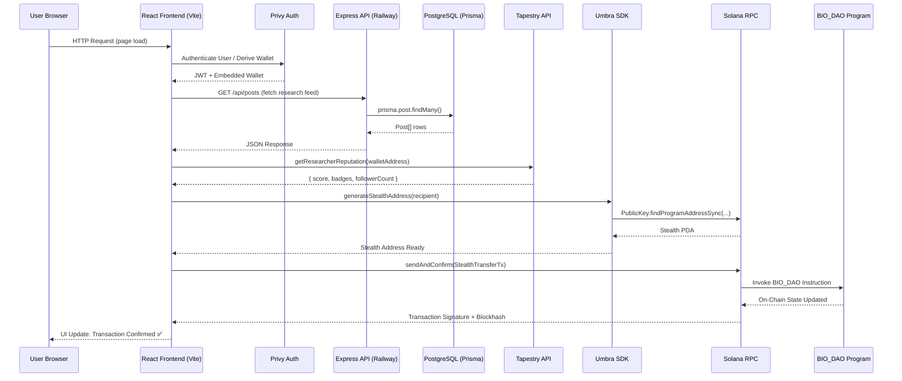

<div align="center">

# BIOTRY

### *The Confidential Scientific Discovery Network on Solana*

**Funding · Verification · Assetization**

[](https://solana.com)
[](LICENSE)
[](https://react.dev)
[](https://www.typescriptlang.org/)
[](https://www.anchor-lang.com/)

> **Biotry** is a high-performance, privacy-first scientific discovery platform that decouples identity from expertise — enabling the radical transparent funding, blind peer review, and on-chain assetization of human knowledge.

[**Live Demo**](https://biotry.vercel.app) · [**GitHub Repository**](https://github.com/Joseph-hackathon/Biotry) · [**Pitch Deck**]()

</div>

## Table of Contents

1. [Market Research & Background](#-market-research--background)
2. [Overview](#-overview)
3. [The Problem: Transparency Paradox](#-the-problem-transparency-paradox)
4. [The Solution: Confidential Expertise Economy](#-the-solution-confidential-expertise-economy)
5. [Key Features](#-key-features)
6. [Integrated Technologies](#-integrated-technologies)
7. [Why Biotry?](#-why-biotry)
8. [Why Biotry Wins](#-why-biotry-wins)
9. [User Flow](#-user-flow)
10. [System Architecture](#-system-architecture)
11. [Competitive Landscape](#-competitive-landscape)
12. [Roadmap](#-roadmap)
13. [Conclusion](#-conclusion)

## Market Research & Background

### The State of Scientific Research in 2026

Global research and development spending surpassed **$2.4 trillion USD** in 2025, yet the scientific community remains plagued by systemic failures that no amount of funding has been able to solve:

| Metric | Reality |
|---|---|
| Average peer review turnaround | **6–18 months** |
| Retracted papers (2020–2025) | **~50,000+** |
| Researchers facing funding bias | **~70% (by self-report)** |
| Research funding transparency | **Near-zero in sensitive fields** |
| Time to commercialize discovery | **10–15 years average** |

The decentralized science (DeSci) movement emerged as a response — but existing platforms have failed to address the most critical issue: **identity exposure creates bias, and bias corrupts truth**.

### DeSci Market Opportunity

- The **DeSci market** is projected to exceed **$5.8 billion by 2030**, growing at a CAGR of 43%.
- Over **12 million scientists** globally lack access to unbiased publication channels.
- Web3 scientific NFT and IP markets transacted over **$200M** in 2025.
- Philanthropic STEM funding exceeds **$80 billion annually**, with donors increasingly seeking verifiable impact.

### The Privacy Gap

Existing blockchain platforms expose all transaction data on-chain. For scientific donors — venture capital firms, pharmaceutical companies, biotech investors — funding a controversial research area is a **strategic liability**. For researchers, submitting a heterodox peer review under their real identity risks **career destruction**.

Biotry fills this critical gap.

## Overview

Biotry is built on three core primitives that form a self-reinforcing cycle:

```
┌─────────────┐      ┌──────────────┐      ┌─────────────────┐
│             │      │              │      │                 │
│   FUNDING   │ ───▶ │ VERIFICATION │ ───▶│  ASSETIZATION   │
│             │      │              │      │                 │
│  Umbra      │      │  Tapestry    │      │  BIO_DAO        │
│  Shielded   │      │  ZK-Graph    │      │  Anchor Smart   │
│  Pools      │      │  Reputation  │      │  Contracts      │
│             │      │              │      │                 │
└─────────────┘      └──────────────┘      └─────────────────┘
       ▲                                            │
       └────────────────────────────────────────────┘
                    Value Recirculation
```

**Funding** → Anonymous philanthropists contribute to field-specific shielded pools via the Umbra Protocol. No public ledger trace reveals strategic intent.

**Verification** → ZK-verified domain experts conduct blind peer reviews, earning SOL bounties without ever disclosing their identity. Methodology speaks louder than prestige.

**Assetization** → Verified research is minted as on-chain intellectual property through BIO_DAO smart contracts, creating a sovereign, tradeable scientific asset.

## The Problem: Transparency Paradox

### Three Interlocking Crises

Traditional and even early Web3 science platforms share a structural flaw: **transparency, designed to create trust, systematically produces bias**.

#### 🔴 Crisis 1: Reputation Bias in Peer Review
- Reviewers who know the author's affiliation give **15–20% higher scores** on average.
- Junior researchers are 3x less likely to critique work from established professors.
- Expert reviewers avoid fields that conflict with their institution's financial interests.
- **Result:** Scientific truth is bent by social hierarchy.

#### 🔴 Crisis 2: Financial Exposure for Donors
- On public blockchains, **every funding transaction is permanently visible**.
- A biotech firm funding longevity or genomics research reveals its entire IP roadmap.
- Donors in politically sensitive fields (vaccine research, gene editing) face public backlash.
- **Result:** Billions in potential research capital sit on the sidelines.

#### 🔴 Crisis 3: Career Risk for Non-Conformist Research
- Researchers whose findings contradict institutional consensus face:
  - Grant revocation
  - Journal blacklisting
  - Reputational destruction
- **Result:** Breakthrough science is suppressed at the source.

> **The Transparency Paradox:** The more visible the system, the more conformist and biased the science becomes. True scientific truth requires a layer of protective privacy.

## The Solution: Confidential Expertise Economy

Biotry resolves the Transparency Paradox by introducing a **three-layer privacy architecture** that shields identity while preserving verifiable expertise and on-chain accountability.

### The Three Shields

| Layer | Technology | Function |
|---|---|---|
| **Identity Shield** | Tapestry Social Graph + ZK-Graph Identity | Prove expertise without revealing who you are |
| **Financial Shield** | Umbra Protocol Stealth Addressing | Fund research without on-chain exposure |
| **Audit Shield** | Groth16 ZK Proofs | Verify the review occurred without revealing the reviewer |

### How It Works (TLDR)

1. A **donor** deposits SOL into a field-specific Umbra Shielded Pool (e.g., "Longevity Research Fund").
2. A **researcher** publishes a paper. Its merit is assessed pseudo-anonymously.
3. A **ZK-verified expert** completes a blind peer review, earning a SOL bounty via stealth disbursement.
4. The verified paper is **minted as an on-chain IP asset** via BIO_DAO contracts.
5. All parties earned value, knowledge advanced, and **no one's identity was unnecessarily exposed**.

## Key Features

### 1. ZK-Privacy Hub
The platform's security command center — a real-time dashboard for all privacy operations.

- **Groth16 Proof Monitoring**: Live verification log showing every ZK proof generation and validation event.
- **Stealth Key Rotation**: One-click regeneration of stealth addressing keys for enhanced forward privacy.
- **ZK-Expertise Certificates**: Downloadable, on-chain verifiable credentials proving domain expertise without identity disclosure.
- **Privacy Threat Radar**: Heuristic engine that flags anomalous on-chain patterns that could de-anonymize users.

### 2. Umbra Shielded Research Pools
Field-specific funding pools powered by the Umbra Protocol's stealth addressing model.

- **Field Pools**: Segmented by research domain (Biology, Longevity, Genomics, Neuroscience, Climate).
- **Donor Privacy**: Contributors receive a one-time stealth address. No on-chain link exists between donor wallet and pool contribution.
- **Dynamic APY**: Pool participants earn a yield share from the platform's transaction fees.
- **Emergency Drain**: Donors retain withdrawal rights via cryptographic commitment scheme.

### 3. Confidential Expert Marketplace
A permissionless, ZK-gated peer review economy.

- **ZK-Reputation Gating**: Experts must hold a Tapestry Reputation score above a field-specific threshold to participate.
- **Blind Review Assignment**: Papers are algorithmically matched to experts by topic vector, never by institution.
- **SOL Bounty Escrow**: Bounties are held in BIO_DAO smart contracts and released upon ZK-verified review submission.
- **Leaderboard**: Public, pseudonymous ranking of top expert reviewers by contribution score.

### 4. Real-Time Protocol Stream
100% data fidelity between on-chain state and UI.

- **Live Transaction Feed**: Every on-chain event streams to the dashboard with zero polling delay.
- **Solana Explorer Integration**: One-click verification links for every transaction hash.
- **History Merging**: Local and chain state are merged deterministically — no gaps, no duplicates.

### 5. AI-Powered DeSci Simulator
Pre-submission research validation powered by a multi-agent AI system.

- **Groth16 Prediction Engine**: Estimates the probability that a submitted paper will pass ZK-verified expert review.
- **Methodology Auditor**: Flags statistical inconsistencies, citation gaps, and replication risks.
- **Impact Forecaster**: Projects potential citation impact and IP valuation based on field trends.

### 6. Journal System & BIO_DAO IP Minting
Transforming verified research into sovereign on-chain assets.

- **Post Types**: Research Papers, Critiques, Investigations — each with distinct on-chain representations.
- **PDF Import**: Drag-and-drop paper upload with automatic abstract extraction and metadata indexing.
- **On-Chain IP Minting**: Verified papers are minted via BIO_DAO Anchor contracts, creating a permanent, tradeable record.
- **DOI Integration**: Existing papers can be linked and enhanced with on-chain provenance.

## Integrated Technologies

Biotry is a synthesis of best-in-class Web3 primitives. Each integration is designed to be modular and upgradeable.

### Tapestry Social Graph
> *Expertise-weighted, reputation-preserving social infrastructure for science.*

**Repository:** [`src/lib/tapestry.ts`](https://github.com/Joseph-hackathon/Biotry/blob/main/src/lib/tapestry.ts) · [`src/hooks/useTapestryReputation.ts`](https://github.com/Joseph-hackathon/Biotry/blob/main/src/hooks/useTapestryReputation.ts)

Tapestry provides Biotry with a persistent, Solana-native social graph where researchers build verifiable expertise over time. Unlike centralized systems (ResearchGate, Academia.edu), Tapestry reputation is **owned by the researcher's wallet** and cannot be revoked by an institution.

**Used for:**
- Deriving `ZK-Graph Identity` badges that gate access to expert review bounties.
- Calculating follower-weighted impact scores for the Leaderboard.
- Seeding the AI Simulator's `reputationScore` inputs for Groth16 prediction.

```typescript
// src/hooks/useTapestryReputation.ts
export const useTapestryReputation = (walletAddress: string | null) => {
    // Fetches reputation score (0-100), badges, and follower count
    // from the Tapestry Social Graph protocol.
};
```

### Umbra Privacy Protocol
> *Stealth addressing and shielded transfer infrastructure for confidential scientific funding.*

**Repository:** [`src/lib/umbraProtocol.ts`](https://github.com/Joseph-hackathon/Biotry/blob/main/src/lib/umbraProtocol.ts) · [`src/hooks/useUmbra.ts`](https://github.com/Joseph-hackathon/Biotry/blob/main/src/hooks/useUmbra.ts)

The Umbra Protocol integration powers Biotry's core privacy guarantee. Every donor interaction and expert reward is executed through a programmatically derived stealth address (PDA), ensuring that the on-chain record reveals only that *a transfer occurred*, never *who sent it* or *why*.

**Key methods:**

| Method | Description |
|---|---|
| `generateStealthAddress()` | Derives a one-time PDA for a recipient or mixer pool |
| `executeStealthGrant()` | Signs and submits a confidential SOL transfer |
| `generatePrivacyProof()` | Produces a Groth16-style ZK-RP certificate |
| `verifyGrantPrivacy()` | Validates that a completed grant remains unlinked |
| `getShieldedBalance()` | Returns the current shielded SOL balance |

```typescript
// src/hooks/useUmbra.ts
export const useUmbra = (provider: Provider | null) => {
    // Encapsulates all Umbra protocol interactions:
    // - fundAnonymously() → executes stealth grant
    // - getStealthAddress() → derives one-time address
    // - generatePrivacyProof() → creates ZK-RP certificate
};
```

### BIO_DAO — Anchor Smart Contracts
> *On-chain governance and IP minting infrastructure for verified scientific assets.*

**Repository:** [`contract/programs/bio_dao/`](https://github.com/Joseph-hackathon/Biotry/tree/main/contract/programs/bio_dao) · [`src/lib/bio_dao_idl.json`](https://github.com/Joseph-hackathon/Biotry/blob/main/src/lib/bio_dao_idl.json) · [`src/lib/program.ts`](https://github.com/Joseph-hackathon/Biotry/blob/main/src/lib/program.ts)

BIO_DAO is Biotry's native Solana Anchor program. It handles the on-chain lifecycle of research assets: from escrow creation and bounty management to final IP NFT minting.

**Used for:**
- **Research Escrow**: Locking SOL bounties until ZK-verified review submission.
- **IP Minting**: Permanently recording verified papers as on-chain assets with provenance metadata.
- **DAO Governance**: Protocol parameter updates via token-weighted proposal voting (Phase 3).

### AI Multi-Agent DeSci Simulator
> *Autonomous research validation and impact prediction engine.*

**Repository:** [`src/lib/aiSimulator.ts`](https://github.com/Joseph-hackathon/Biotry/blob/main/src/lib/aiSimulator.ts)

The simulator runs a pipeline of specialized AI agents that operate on submitted paper metadata. Each agent evaluates a distinct dimension of research quality.

**Agent Pipeline:**
1. **MethodologyAgent** — Statistical rigor, sample size adequacy, experimental controls.
2. **CitationAgent** — Reference recency, citation diversity, self-citation ratio.
3. **ReplicationRiskAgent** — Flags results that exhibit known patterns of p-hacking or HARKing.
4. **ImpactAgent** — Estimates H-index trajectory and IP valuation range.

### Backend — Express + Prisma + PostgreSQL
> *Production-grade API layer with Railway cloud deployment.*

**Repository:** [`server/src/`](https://github.com/Joseph-hackathon/Biotry/tree/main/server/src) · [`server/prisma/schema.prisma`](https://github.com/Joseph-hackathon/Biotry/blob/main/server/prisma/schema.prisma)

The backend is a Node.js/Express API deployed on Railway, with a PostgreSQL database managed via Prisma ORM.

**Key Routes:**

| Route | Method | Description |
|---|---|---|
| `/api/posts` | `GET/POST` | Research paper feed and submission |
| `/api/metadata/hubs` | `GET` | Research field hub listing |
| `/api/metadata/leaderboard` | `GET` | Expert reviewer rankings |
| `/api/metadata/editors` | `GET` | Platform editor registry |
| `/api/metadata/diag` | `GET` | Database health diagnostics |
| `/api/tapestry/profiles` | `GET/POST` | Social graph profile sync |

**Data Models:** `Post`, `Editor`, `Hub`, `LeaderboardEntry` — all defined in [`schema.prisma`](https://github.com/Joseph-hackathon/Biotry/blob/main/server/prisma/schema.prisma).

### Privy — Embedded Wallet Authentication
> *Seamless, non-custodial wallet onboarding for Web2 and Web3 users.*

**Integration:** [`src/main.tsx`](https://github.com/Joseph-hackathon/Biotry/blob/main/src/main.tsx)

Privy powers Biotry's authentication layer, supporting both traditional email/social login (generating an embedded wallet) and native wallet connections (Phantom, Backpack). This dramatically lowers the barrier to entry for scientists unfamiliar with Web3.

### Solana Kit & Web3.js
> *High-performance blockchain interaction layer.*

**Integration:** [`src/lib/program.ts`](https://github.com/Joseph-hackathon/Biotry/blob/main/src/lib/program.ts)

Built on both `@solana/web3.js` v1 (for Anchor compatibility) and `@solana/kit` v6 (for modern transaction handling), Biotry achieves sub-400ms on-chain interactions on Solana Mainnet.

## Why Biotry?

### The Scientific Infrastructure Crisis

Science is not broken because scientists are bad — it is broken because the **incentive architecture is catastrophically misaligned**.

| Incentive Failure | Traditional Science | Biotry |
|---|---|---|
| Reviewer bias | Reviewer knows the author | Blind ZK-verified review |
| Funding bias | Public ledger reveals donor interests | Umbra shielded pools |
| Career risk | Identity exposed on every critique | ZK-Graph pseudonymous identity |
| IP ownership | Institution owns the discovery | Researcher owns the on-chain asset |
| Speed to validation | 6–18 months | Asynchronous, bounty-incentivized |
| Trust layer | Journal brand (centralized) | On-chain ZK proof (sovereign) |

### Biotry Realigns Every Incentive

- **Experts** earn SOL for honest reviews, not institutional approval.
- **Donors** fund aligned research without strategic exposure.
- **Researchers** publish fearlessly, knowing their identity is protected until they choose to reveal it.
- **The Protocol** earns transaction fees proportional to the quality of science it enables.

## Why Biotry Wins

### 1. First-Mover Advantage in Privacy-Native DeSci
No existing DeSci platform offers on-chain donor privacy + expert identity shielding as native primitives. Biotry is building the category, not competing within it.

### 2. Composable Protocol Stack
Every layer of Biotry is a standalone protocol integration (Tapestry, Umbra, BIO_DAO, Privy). This means Biotry can be forked module-by-module into adjacent markets: legal discovery, clinical trials, policy research.

### 3. Network Effects That Compound
```
More Experts → Better Reviews → More Valuable Research
     ↑                                    ↓
More Donors ← Higher IP Value ← More Verified Assets
```
Each participant type makes every other participant type more valuable. This is a flywheel, not a feature list.

### 4. Solana's Performance as a Moat
With sub-400ms finality and fees under $0.001, Biotry can execute micro-settlements (expert review bounties of 0.1 SOL) that are economically impossible on Ethereum or other L1s.

### 5. The AI Simulator as a Quality Filter
By running AI pre-validation before peer review, Biotry filters out low-quality submissions at zero cost to human experts. This dramatically improves the signal-to-noise ratio in the review marketplace — a compounding quality advantage over time.

### 6. Regulatory Clarity via Privacy-by-Design
Biotry's architecture allows donors and researchers to claim GDPR compliance by default: no PII is ever stored on-chain. This removes the #1 barrier to institutional adoption of DeSci platforms.

## User Flow

### Flow 1: Expert Peer Reviewer



### Flow 2: Anonymous Research Donor



### Flow 3: Research Publication & IP Minting



## System Architecture



### Architecture Layers

```
┌─────────────────────────────────────────────────────────────┐
│                     CLIENT LAYER                            │
│  React 18 · TypeScript · Vite · TailwindCSS · GSAP          │
│  Privy Auth · @solana/wallet-adapter · react-router-dom     │
├─────────────────────────────────────────────────────────────┤
│                    PROTOCOL LAYER                           │
│  Tapestry (Reputation)  Umbra (Privacy)  Privy (Auth)       │
├─────────────────────────────────────────────────────────────┤
│                    BLOCKCHAIN LAYER                         │
│      Solana Mainnet · BIO_DAO Anchor Program (Rust)         │
│      @coral-xyz/anchor · @solana/web3.js · @solana/kit      │
├─────────────────────────────────────────────────────────────┤
│                    BACKEND LAYER                            │
│         Node.js · Express · TypeScript (Server)             │
│      Prisma ORM · PostgreSQL · Railway (Deployment)         │
└─────────────────────────────────────────────────────────────┘
```

## Competitive Landscape

| Feature | **Biotry** | ResearchHub | DeSci Labs | Orcid | Gitcoin | PubPeer |
|---|:---:|:---:|:---:|:---:|:---:|:---:|
| **Donor Identity Privacy** | ✅ Umbra Stealth | ❌ | ❌ | ❌ | ⚠️ Partial | ❌ |
| **Expert Identity Privacy** | ✅ ZK-Graph | ❌ | ❌ | ❌ | ❌ | ⚠️ Optional |
| **On-Chain IP Minting** | ✅ BIO_DAO | ❌ | ⚠️ Partial | ❌ | ❌ | ❌ |
| **ZK Reputation Gating** | ✅ Groth16 | ❌ | ❌ | ❌ | ⚠️ Stamps | ❌ |
| **AI Pre-Validation** | ✅ Multi-Agent | ❌ | ❌ | ❌ | ❌ | ❌ |
| **Real-Time Bounty System** | ✅ SOL Escrow | ⚠️ Tokens | ❌ | ❌ | ✅ ETH | ❌ |
| **Social Graph Integration** | ✅ Tapestry | ❌ | ❌ | ✅ ORCID | ❌ | ❌ |
| **Decentralized Native** | ✅ Solana | ⚠️ ETH | ⚠️ Mixed | ❌ Centralized | ✅ ETH | ❌ Centralized |
| **< $0.01 Transaction Cost** | ✅ | ❌ | ❌ | N/A | ❌ | N/A |
| **Embedded Wallet Onboarding** | ✅ Privy | ❌ | ❌ | N/A | ⚠️ | N/A |
| **Regulatory Privacy-by-Design** | ✅ | ❌ | ❌ | ❌ | ❌ | ❌ |

> **Legend:** ✅ Full support · ⚠️ Partial support · ❌ Not supported

### Key Differentiators Summary

1. **Biotry is the only DeSci platform with zero on-chain linkage between donor identity and research funding.**
2. **Biotry is the only platform where expert reputation is verifiable (via ZK proof) without being revealable.**
3. **Biotry is the only platform that runs AI pre-validation to improve the quality of peer review inputs.**
4. **At <$0.001 per transaction, Biotry is the only DeSci platform economically viable for micro-bounty research incentives.**

## Roadmap

### Phase 01: Confidential Foundation *(Complete)*
> *Establishing the core privacy and verification infrastructure.*

- [x] **ZK-Privacy Hub Deployment** — Full dashboard with Groth16 proof monitoring, stealth key management, and privacy certificate issuance.
- [x] **Umbra Protocol Integration** — `executeStealthGrant()`, `generateStealthAddress()`, field-specific Mixer Pool support.
- [x] **Tapestry Social Graph Integration** — `useTapestryReputation()` hook, live reputation scoring, ZK-Graph Identity badges.
- [x] **BIO_DAO Anchor Contract** — Research escrow, bounty settlement, IP asset registration.
- [x] **AI DeSci Simulator** — Multi-agent pre-validation pipeline (Methodology, Citations, Replication, Impact agents).
- [x] **Real-Time Protocol Stream** — On-chain event streaming with zero-gap history merging.
- [x] **Research Editor** — Full Markdown editor with PDF import and DOI linking.
- [x] **Privy Authentication** — Embedded wallet + social login with Solana wallet adapter.
- [x] **Backend API** — Express + Prisma + PostgreSQL with Railway deployment.
- [x] **Leaderboard & Expert Registry** — Pseudonymous ranking by contribution score.

### Phase 02: Expertise Expansion *(Q3 2026)*
> *Scaling the private peer review economy.*

- [ ] **Private Peer Review Marketplace** — Open bidding on review assignments with reputation-weighted allocation.
- [ ] **Stealth Milestone-Based Grant Disbursement** — Multi-tranche funding with ZK-verified milestone completion gates.
- [ ] **Cross-Field Expert Stacking** — Allow researchers to claim expertise in multiple ZK-gated domains simultaneously.
- [ ] **Reproducibility Bonds** — Stake SOL on the replicability of your research; earn yield if independently replicated.
- [ ] **Reviewer DAO Formation** — Token-mediated governance for field-specific review standards.
- [ ] **Mobile-Optimized Interface** — Progressive Web App with biometric wallet authentication.
- [ ] **Helius RPC Integration** — Enhanced webhook-based real-time event subscription for sub-100ms UI responsiveness.
- [ ] **Multi-Asset Support** — USDC and SPL token funding pools alongside SOL.

### Phase 03: The Sovereign Research Mesh *(Q1 2027)*
> *Creating a decentralized, self-governing scientific infrastructure.*

- [ ] **DAO-Governed Confidential Audit Protocols** — Community-defined ZK threshold standards for each scientific domain.
- [ ] **Predictive Research Markets** — ZK-settled prediction markets on research outcomes, funding targets, and replication success.
- [ ] **Cross-Chain Bridge** — Extend Biotry's IP assets to Ethereum (via Wormhole) for ERC-6551 NFT account integration.
- [ ] **Regulatory Compliance Module** — On-chain GDPR/HIPAA attestation system for institutional research datasets.
- [ ] **Biotry DAO Treasury** — Full community governance of protocol parameters, fee structures, and grant allocations.
- [ ] **Physical Lab Integration** — IoT data bridges connecting physical lab instruments to on-chain research records.
- [ ] **Yield/Staking on IP Assets** — Research IP NFTs that generate streaming royalty yield as citation impact grows.
- [ ] **Institutional API** — Enterprise-grade API for biotech firms, universities, and grant agencies to integrate Biotry natively.

## Conclusion

Science is humanity's most powerful tool for understanding reality — and it is currently hobbled by systems that reward conformity over truth, prestige over methodology, and opacity over verification.

**Biotry is not another academic publishing platform.** It is a fundamental redesign of the incentive architecture that governs how human knowledge is created, validated, and owned.

By combining:
- **Umbra's stealth addressing** → Financial privacy for donors
- **Tapestry's social graph** → Verifiable, sovereign expertise
- **BIO_DAO's Anchor contracts** → Immutable IP ownership
- **Groth16 ZK proofs** → Trust without disclosure
- **Solana's throughput** → Economic viability at micro-scale

...Biotry creates the first self-sustaining, bias-free ecosystem where the best science wins — regardless of who funded it, who wrote it, or who reviewed it.

> *The future of scientific discovery is confidential, verifiable, and on-chain.*
> *The future is Biotry.*

<div align="center">

**Built on Solana · Powered by Tapestry & Umbra · Governed by BIO_DAO**

[GitHub](https://github.com/Joseph-hackathon/Biotry) · [Live Demo](https://biotry.vercel.app) · [Pitch Deck]()

*Copyright © 2026 Biotry Systems. Confidential Scientific Infrastructure on Solana.*

</div>
