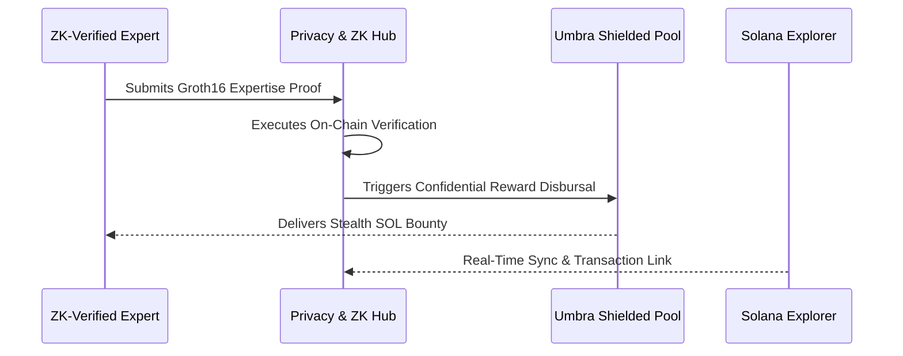

# Biotry: The Confidential Expertise Economy on Solana

Biotry is the high-performance scientific discovery network where privacy is the catalyst for truth. By integrating **Umbra-powered stealth addresses** and **ZK-Reputation Proofs**, Biotry creates a sovereign, bias-free ecosystem for the funding, verification, and assetization of human knowledge.

---

## The Core Problem: Transparency Bias

Traditional research is stalled by reputation bias and financial exposure. Donors avoid sensitive fields, and experts are often penalized for non-conformist peer reviews. Biotry solvs this **Transparency Paradox** by decoupling identity from expertise, allowing the methodology to speak for itself.

## Flagship Features: The ZK Evolution

### 1. ZK-Privacy Hub
The platform's security command center. Monitor Groth16 verification logs, rotate stealth keys, and manage ZK-Expertise proofs in a single high-fidelity interface.

### 2. Confidential Expertise Economy
Experts earn SOL bounties for ZK-verified peer reviews without revealing their identity. Bias-free scientific rewards powered by **ZK-Graph Identity**.

### 3. Umbra Shielded Pools
Field-specific mixer pools (Biology, Longevity, Genomics) allow philanthropists to fund research without revealing strategic interests on public ledgers.

### 4. Real-Time Protocol Stream
100% data fidelity between on-chain state and UI. Every transaction includes direct Solana Explorer integration and instant activity logging.

---

## Technical Stack

- **L1 Layer**: Solana (High-throughput discovery mesh)
- **Privacy Layer**: Umbra (Stealth addressing & donor-shielding)
- **Identity Layer**: ZK-Reputation (Trust without disclosure)
- **Audit Engine**: Multi-Agent DeSci Simulators (Groth16 predictions)

---

## Operational Sequence: Shielded Discovery

---

## Project Roadmap

**Phase 01: Confidential Foundation (Complete)**
- ZK-Privacy Hub Deployment.
- Umbra Shielded Pool Integration.
- Real-time interaction stream and history merging.

**Phase 02: Expertise Expansion**
- Private Peer Review marketplace.
- Stealth Milestone-based grant disbursement.

**Phase 03: The Sovereign Research Mesh**
- DAO-governed confidential audit protocols.
- Predictive research markets with ZK-settlement.

---
Copyright 2026 Biotry Systems // Confidential Scientific Infrastructure on Solana
