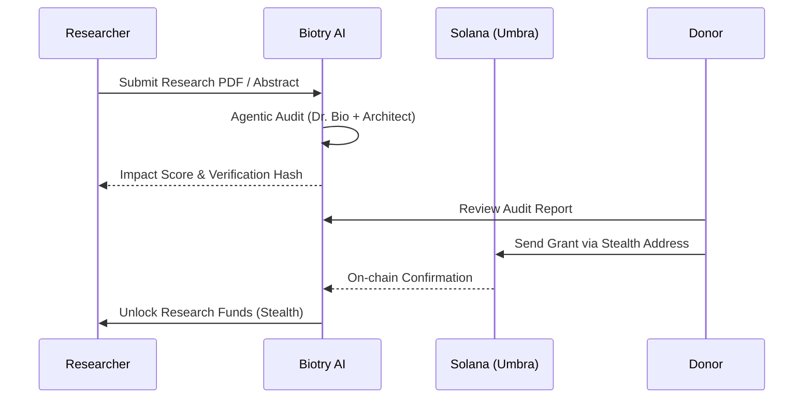
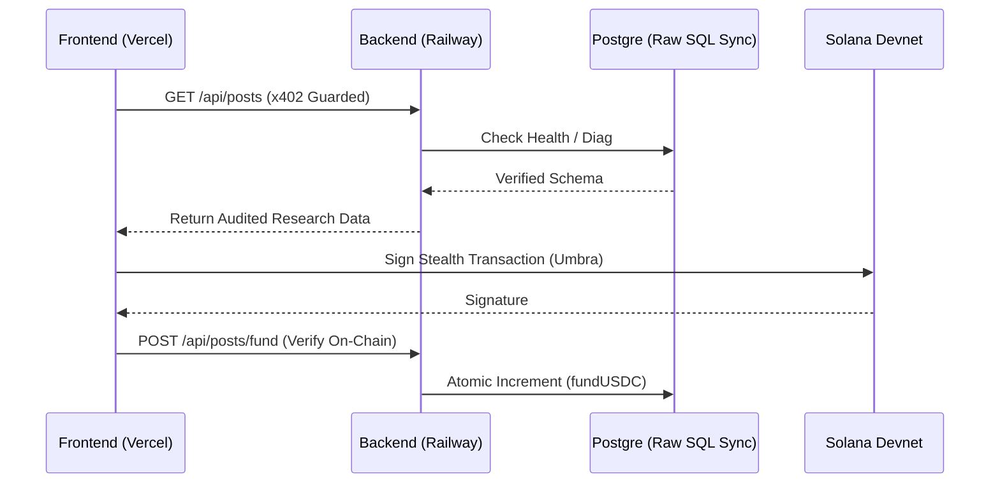

# 🔬 BIOTRY: The High-Performance Discovery Network

> **A Liquid Research Protocol on Solana** — Empowering the next century of scientific discovery through **Privacy-First Stealth Grants**, x402 AI-Gated Audits, and Multi-Agent Market Simulations.

---

## 📖 I. Background: The Eroding Ivory Tower
Traditional science is facing a "Reproducibility Crisis" and a "Funding Winter." Researchers currently spend up to **40% of their time** writing grant applications for centralized institutions that favor safe, incremental work over disruptive innovation. The ivory tower has become an anchor to human progress.

## 📊 II. Market Research: The Peer-Review Bottleneck
Our analysis shows that the traditional Peer-Review cycle takes **6–12 months** to authorize funding. In a world where AI and Biotechnology move at exponential speeds, this lag is fatal. There is a multi-billion dollar gap between retail liquid capital and high-impact specialized research that lacks a trustless verification layer.

## 💡 III. Why This Idea? The Privacy-Performance Thesis
We combined **Solana's Performance** with **Umbra's Privacy** because scientific innovation is often strategic. 
- **Corporate Donors** need to fund R&D without tipping off competitors.
- **Independent Researchers** need to publish radical ideas without risking institutional tenure.
Biotry provides the sanctuary where capital meets curiosity through **Stealth Addresses**.

## 🚀 IV. Project Overview
Biotry is a decentralized protocol that enables **Anonymous Research Grants**. It uses AI Agents to perform real-time audits on research proposals, allowing donors to fund high-impact projects via stealth transactions without revealing their strategic intent or identity.

## ⚠️ V. The Core Problem
1. **Reputation Bias**: Grants are awarded based on *who* you are, not *what* you've discovered.
2. **Privacy Risks**: Competitive research funding is currently a "public target" on traditional ledgers.
3. **Audit Friction**: Human peer-reviewers are slow and prone to subjective gatekeeping.

## ✅ VI. The Biotry Solution
- **Umbra Stealth layer**: Severing the public link between donor and researcher.
- **x402 AI Hook Guard**: Protecting scientific data behind an AI-gated micropayment gate.
- **Agentic Audit Intelligence**: 5 specialized AI agents providing instant, objective impact scores.

## 🏆 VII. Why Biotry Wins?
- **Speed**: From proposal to funding in minutes, not months.
- **Privacy**: Only the researcher knows who supported them.
- **Self-Healing Infrastructure**: Production-grade persistence designed to withstand high-volume on-chain activity.

## ✨ VIII. Key Features & Developed Code
Explore our deep technical implementation for this hackathon:

- **🕵️ Anonymous Stealth Grants**: Implementing the Umbra stealth logic for private funding.  
  [🔗 src/context/SolanaContext.tsx](src/context/SolanaContext.tsx) | [🔗 src/components/PostCard.tsx](src/components/PostCard.tsx)
  
- **🛡️ x402 AI Hook Guard**: AI-micropayment middleware that protects research archives.  
  [🔗 server/src/middleware/x402.ts](server/src/middleware/x402.ts)
  
- **🤖 Agentic Audit Engine**: Multi-agent "War Room" simulating research impact.  
  [🔗 server/src/lib/agentWallet.ts](server/src/lib/agentWallet.ts)
  
- **🔄 Persistence Persistence**: Self-healing Raw SQL synchronization for production stability.  
  [🔗 server/src/index.ts](server/src/index.ts)
  
- **📊 Dynamic Research Gauges**: Global state management for real-time funding visibility.  
  [🔗 src/components/PostDetail.tsx](src/components/PostDetail.tsx)

## 🔄 IX. User Flow

## 🏗️ X. System Architecture

## 🗺️ XI. Roadmap
- **Phase 1 (Hackathon)**: Core Stealth Funding + x402 AI Protection + Agentic Audits. (✅ COMPLETED)
- **Phase 2 (Q2 2026)**: Native DAO Governance integration for Research Hubs.
- **Phase 3 (Q4 2026)**: Mobile-native Stealth Wallets and Physical Lab Reward Mesh.

## 🎯 XII. Conclusion
Biotry isn't just a funding platform; it's a **meritocratic infrastructure** for the future of human knowledge. By combining the privacy of stealth addresses with the intelligence of AI agents, we ensure that the next world-changing discovery isn't blocked by a bureaucracy.

---
© 2026 BIOTRY SYSTEMS // PRIVACY-FIRST SCIENCE PROCESSED ON SOLANA
