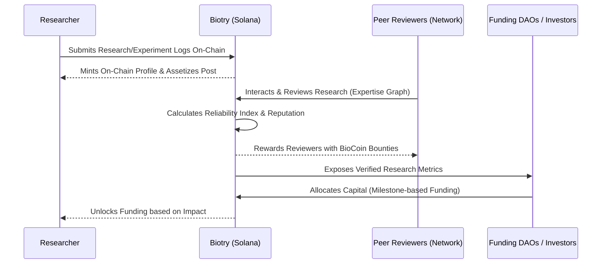

# Biotry: The Social Graph of Science

## Market Research
Science is currently stuck in Web2 silos. Research is trapped in opaque journals where reward structures are significantly distorted. Early-stage researchers lack access to crucial capital, while investors are forced to bet blindly with massive information asymmetry. Existing social platforms like Reddit and Twitter are used to discuss research, but they fundamentally lack verification systems and trust-based structures. There is a pressing market demand for a **Credibly Neutral** infrastructure where reputation is quantifiable and expertise becomes a tangible new asset class.

## Background
Biotry emerges as the first On-Chain Social Network designed specifically for scientific research. Built on the high-performance Solana blockchain, it addresses the core inefficiencies in academic publishing and research funding by tokenizing reputation and creating an interconnected professional expertise graph.

## The Problem
1. **Opaque Research**: Vital data and studies are locked behind expensive paywalls and centralized gatekeepers.
2. **Slow Valuation**: Centralized evaluation and peer review cycles take years, drastically slowing down innovation.
3. **Funding Asymmetry**: A massive information gap exists between brilliant early-stage researchers and the capital markets willing to fund them.

## Our Solution
Biotry acts as a Solana-based, on-chain research network where impact metrics are directly derived from a graph of professional expertise. We turn research storytelling into a real-time, transparent, and financially rewarding process.

## What is Biotry?
Biotry is the foundational infrastructure for research assets and scientific social graphs. It serves as a decentralized hub for peer-reviewed science, open-access publishing, and cryptographic verification, entirely powered by **BioCoin**. While traditional platforms are for sharing and basic rewards, Biotry creates a structural expertise network for professional matching and capital allocation.

## Why it is Needed
The world needs a system where research performance, rather than ad revenue or viral follower metrics, drives ecosystem value. Biotry replaces the trustless, centralized nature of traditional media platforms with **On-Chain Verified Trust**, finally making research a calculable, tradable, and reliably indexable asset. 

## Key Features
*   **On-Chain Profile (Expertise Graph)**: Metadata-driven professional identity that includes academic fields, research themes, and ZK-verified career paths.
*   **On-Chain Posts (Real-Time Stream)**: Experiment logs, datasets, and papers are published as on-chain posts (utilizing layers like Tapestry). Peer reviews are immutably tracked via an influence graph.
*   **DAO Funding (Assetized Results)**: Bio Protocol-driven funding pools and Research DAOs scale milestone-based rewards for proven scientific impact.
*   **Reputation Model**: Sophisticated Expertise Metrics and an Impact Index calculated based on peer influence within the social graph.

## Sequence Diagram
Below is the workflow illustrating how a researcher publishes work, gains verification, and unlocks funding.

## How It Works
1.  **Publish**: Researchers create an on-chain identity and log their experiments, preprints, and raw data via a real-time stream.
2.  **Verify**: The decentralized network of established peers evaluates and reviews this content. 
3.  **Calculate**: As the content proves reliable and impactful, the researcher's on-chain reputation (Reliability Index) dynamically increases.
4.  **Fund**: This highly visible, verified reputation allows Funding DAOs and investors to seamlessly discover and allocate capital to researchers based on achievable, measurable milestones.

## How to Utilize Bounties
Bounties are a core component of Biotry's DAO Funding structure, driven by **BioCoin**:
*   **Peer Review Bounties**: The network issues continuous BioCoin bounties to qualified experts. Reviewers apply to the pilot program and get rewarded securely for providing high-quality, verified manuscript critiques. 
*   **Research Problem Bounties**: DAOs and investors can spin up milestone-based bounties targeted at specific scientific problems or unresearched niches. 
*   **Bounty Fulfillment**: Researchers claim these bounties upon submitting irreproachably proven data. Once network consensus validates the work via the Expertise Graph, the bounty is automatically distributed to the contributors via Solana smart contracts—ensuring fast, transparent, and fair compensation. 
