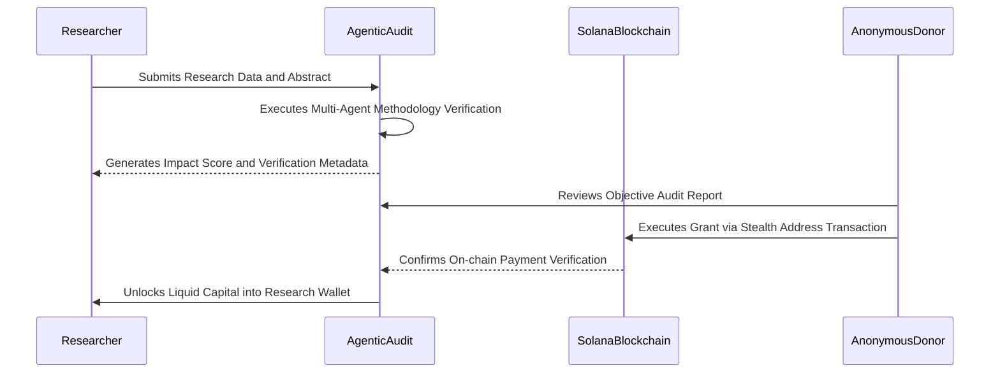
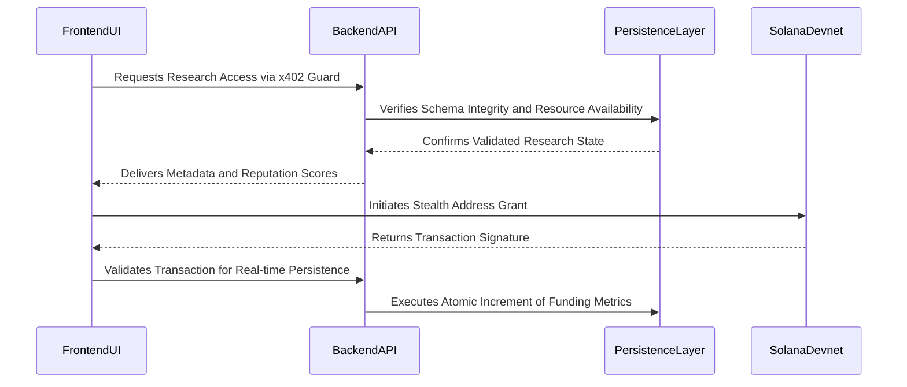

# Biotry: The High Performance Discovery Network on Solana

Biotry is an integrated scientific liquidity and validation protocol designed to bridge the gap between breakthrough research and decentralized capital. By combining high-performance computing on Solana with privacy-preserving stealth addresses and multi-agent artificial intelligence, Biotry creates a trustless environment for the publication, audit, and funding of the next generation of human knowledge.

---

## The Genesis of Scientific Stagnation

The modern scientific endeavor is currently restricted by a centralized, gate-kept model of validation and funding. Researchers spend an average of forty percent of their professional time drafting grant applications that are often reviewed by competitors or institutional bodies with an inherent bias toward incremental rather than disruptive progress. This bureaucratic overhead has led to a stagnation in high-risk high-reward research fields, as the current system fails to provide the speed or privacy required for strategic innovation.

## Market Analysis and the Need for Decentralized Science

Traditional scientific funding models operate on cycles of six to twelve months, a tempo that is incompatible with the exponential growth of fields like artificial intelligence and biotechnology. Furthermore, the lack of a liquid marketplace for research means that valuable intellectual assets remain siloed within academic institutions. There is an urgent market demand for a protocol that can provide immediate objective audits and anonymous funding layers to facilitate rapid capital deployment into verified research opportunities.

## The Biotry Thesis: Converging Intelligence and Anonymity

The core philosophy of Biotry lies at the intersection of three technological pillars: Solana's transaction performance, Umbra's privacy-preserving stealth addresses, and the objective verifying power of large language model agents. We believe that by removing identity-based bias from both the researcher and the donor, we can create a pure meritocracy of ideas. In this sapphire sanctuary of science, only the methodology and the projected impact matter, not the institutional affiliation or the strategic identity of the supporter.

## Project Overview

Biotry serves as a comprehensive ecosystem for the entire research lifecycle. It provides an interface for researchers to publish their findings, a Discovery Mesh to establish authority through on-chain reputation, an AI Research Simulator to verify technical claims, and a Stealth Funding layer to secure capital anonymously. This unified approach transforms scientific research from a static publication into a liquid, verifiable, and fundable asset class on the Solana blockchain.

## Challenges in Contemporary Research Infrastructure

The current research landscape faces three systemic barriers. First, Reputation Bias ensures that funding is diverted toward established names rather than novel ideas. Second, Visibility Risk creates a scenario where strategic donors avoid funding sensitive research to prevent their interests from being exposed on public ledgers. Third, Data Inaccessibility prevents the monetization of incremental research results, forcing scientists to wait for major breakthroughs before realizing any financial return on their labor.

## The Biotry Solution Architecture

Biotry addresses these challenges through a multi-layered protocol design. The Discovery Mesh uses the Tapestry social graph to build expert-weighted reputation scores. The AI Research Simulator utilizes a war room of five specialized agents to provide instant, objective audits. The Umbra stealth layer utilizes stealth addresses to sever the public link between the funding source and the recipient. Finally, the x402 Hook Guard provides an AI-gated micropayment system that allows researchers to monetize access to their detailed archives securely.

## Comparative Dominance Over Legacy Systems

Unlike traditional crowdfunding or existing decentralized science platforms, Biotry does not rely on simple popularity contests. Our integration of the Agentic Audit Engine ensures that every proposal is technically vetted before it reaches the funding stage. Furthermore, our focus on high-performance persistence ensures that the protocol remains stable under the demands of production-level activity, providing a professional experience that rivals institutional portals while maintaining decentralized autonomy.

## Core Infrastructure and Implementation Links

The following segments represent the primary technical implementations developed for the Biotry protocol. Reviewers and contributors can verify the logic through the internal source code links provided below.

### Discovery Mesh and Expertise Graph
The Discovery Mesh establishes an expertise-weighted reputation ecosystem, mapping relationships between scientists and their research impacts.
[Implementation: src/components/ProfileView.tsx](src/components/ProfileView.tsx)

### AI Research Simulator and Agentic War Room
This module predicts research viability through a consensus of specialized AI agents including auditors, architects, and strategists.
[Implementation: src/pages/SimulatePage.tsx](src/pages/SimulatePage.tsx)

### Privacy Preserving Stealth Funding Layer
Utilizing stealth addresses to facilitate anonymous grants, protecting the strategic interests of both the researcher and the donor.
[Implementation: src/context/SolanaContext.tsx](src/context/SolanaContext.tsx)

### x402 AI Hook Guard Security Middleware
A micropayment-based protection layer that prevents unauthorized access to high-value research archives and data assets.
[Implementation: server/src/middleware/x402.ts](server/src/middleware/x402.ts)

### Production Persistence and Database Synchronization
A self-healing infrastructure designed to maintain data integrity and schema consistency across distributed deployments.
[Implementation: server/src/index.ts](server/src/index.ts)

## Operational Sequence Model

The following sequence diagram outlines the interaction between the researcher, the artificial intelligence audit layer, and the anonymous donor during a standard funding cycle.

## System Interaction Model

The internal architectural flow of Biotry ensures that data moves securely from the high-performance frontend through the protected backend layers to the global ledger.

## Future Evolutionary Path

The development of Biotry is structured across three primary phases to ensure long-term protocol viability and growth.

**Current Phase: Institutional Foundation**
Completion of the core stealth funding architecture, AI-gated security middleware, and initial multi-agent audit simulations.

**Secondary Phase: Autonomous Governance**
Implementation of decentralized hub governance, allowing specialized scientific communities to manage their own reputation and audit parameters on-chain.

**Tertiary Phase: Global Knowledge Mesh**
Expansion into mobile-native stealth environments and the integration of physical laboratory oracles to verify real-world experimental results directly on the blockchain.

## Summary of Mission

Biotry represents more than a funding platform; it is the fundamental infrastructure for a truly meritocratic future of human knowledge. By severing the ties between identity and discovery, and replacing bureaucratic delay with agentic intelligence, we ensure that the most impactful ideas move from hypothesis to reality with the speed and privacy they deserve.

---
Copyright 2026 Biotry Systems // Professional Scientific Infrastructure on Solana
