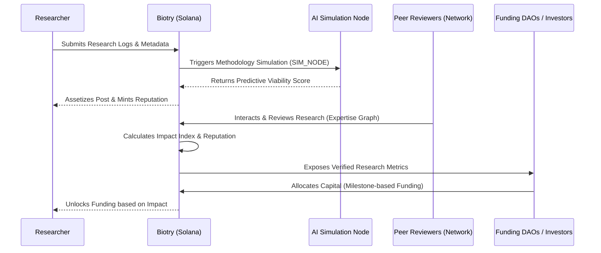

# BIOTRY: The Universal Protocol for Open Science


Biotry is a high-performance Decentralized Science (DeSci) protocol built on Solana. It bridges the gap between fragmented scientific research and capital markets through a verifiable social graph, AI-driven trial simulations, and on-chain expertise metrics.

---

## Market Research
Science is currently stuck in Web2 silos. Research is trapped in opaque journals where reward structures are significantly distorted. Early-stage researchers lack access to crucial capital, while investors are forced to bet blindly with massive information asymmetry. Existing social platforms like Reddit and Twitter are used to discuss research, but they fundamentally lack verification systems and trust-based structures. There is a pressing market demand for a **Credibly Neutral** infrastructure where reputation is quantifiable and expertise becomes a tangible new asset class.

## Background
Biotry emerges as the first On-Chain Social Network designed specifically for scientific research. Built on the high-performance Solana blockchain, it addresses the core inefficiencies in academic publishing and research funding by tokenizing reputation and creating an interconnected professional expertise graph.

## The Problem
1. **Opaque Research**: Vital data and studies are locked behind expensive paywalls and centralized gatekeepers.
2. **Slow Valuation**: Centralized evaluation and peer review cycles take years, drastically slowing down innovation.
3. **Funding Asymmetry**: A massive information gap exists between brilliant early-stage researchers and the capital markets willing to fund them.
4. **Methodology Risk**: Traditional peer review often fails to predict the reproducibility of research before significant capital is spent.

## Our Solution
Biotry acts as a **fluid verification layer** where expertise is assetized and research is simulated. By combining Solana's high-speed transactions with decentralized AI simulations, we turn scientific storytelling into a transparent, verifiable, and financially rewarding outcome.

---

## Core Pillars & Technical Implementation

### 1. Discovery (Social Graph Mesh)
A living ecosystem of scientific expertise, visualizing the relationships between scientists, citations, and funding in real-time.
- **Expertise Analytics**: Quantifiable metrics for scientific impact.
- **Social Graph Mesh**: Powered by our [Tapestry Integration](file:///c:/Users/PC_1M/Desktop/Biotry/src/lib/tapestry.ts).

### 2. Simulation (AI Trial Sandbox)
Predict the reproducibility of research through decentralized AI nodes in a secure sandbox.
- **SIM_NODE Executor**: Decentralized AI agents that simulate trial outcomes using [AI Simulation Logic](file:///c:/Users/PC_1M/Desktop/Biotry/src/lib/aiSimulator.ts).

### 3. Identity (On-chain Reputation)
Verified scientific identity stored immutably on the Solana blockchain.
- **ZK-Identity**: Prove credentials without compromising privacy via [Solana Social Providers](file:///c:/Users/PC_1M/Desktop/Biotry/src/components/providers/SocialProviders.tsx).
- **Reputation Layer**: Managed by the [Solana Context & Anchor Integration](file:///c:/Users/PC_1M/Desktop/Biotry/src/context/SolanaContext.tsx).

### 4. Governance (DAO Protocol)
Community-driven capital allocation and network evolution.
- **Bio Protocol & DAO**: Milestone-based funding for verified scientific problems, implemented in [bioProtocol Core](file:///c:/Users/PC_1M/Desktop/Biotry/src/lib/bioProtocol.ts) and the [Solana Anchor Program](file:///c:/Users/PC_1M/Desktop/Biotry/contract/programs/bio_dao/src/lib.rs).

---

## Why it is Needed
The world needs a system where research performance, rather than ad revenue or viral follower metrics, drives ecosystem value. Biotry replaces the trustless, centralized nature of traditional media platforms with **On-Chain Verified Trust**, making research a calculable, tradable, and reliably indexable asset.

---

## Technical Architecture

### Sequence Diagram: Research Flow
Below is the workflow illustrating how a researcher publishes work, gains verification, and unlocks funding.



### User Flow Diagram
1. **Onboard**: Connect via [Solana Wallet](file:///c:/Users/PC_1M/Desktop/Biotry/src/context/SolanaContext.tsx) and verify identity.
2. **Discover**: Browse the research feed in [JournalView](file:///c:/Users/PC_1M/Desktop/Biotry/src/components/JournalView.tsx).
3. **Simulate**: Run AI trials on research nodes via the [AI Simulator](file:///c:/Users/PC_1M/Desktop/Biotry/src/lib/aiSimulator.ts).
4. **Verify**: Gain reputation through high-impact peer review and successful simulations.
5. **Governance**: Participate in DAO voting and milestone funding in the [Governance Dashboard](file:///c:/Users/PC_1M/Desktop/Biotry/src/components/DeSciDashboard.tsx).

---

## How to Utilize Bounties
Bounties are a core component of Biotry's DAO Funding structure, driven by **Bio Protocol**:
- **Peer Review Bounties**: Qualified experts get rewarded via [Bio Bounty Logic](file:///c:/Users/PC_1M/Desktop/Biotry/src/lib/bioProtocol.ts) for providing verified critiques.
- **Research Problem Bounties**: Investors spin up milestone-based bounties for specific scientific goals.
- **Fulfillment**: Bounty distribution is automated via [Solana Smart Contracts](file:///c:/Users/PC_1M/Desktop/Biotry/contract/programs/bio_dao/src/lib.rs).

---

## Tech Stack
- **Frontend**: React 18, Vite, GSAP (Animations), Tailwind CSS.
- **Blockchain**: Solana, Anchor Framework.
- **Services**: Tapestry (Social Graph), Privy (Authentication).

## Installation & Development
```bash
npm install
npm run dev
```

© 2026 BIOTRY SYSTEMS // DISTRIBUTED VIA SOLANA & AI
