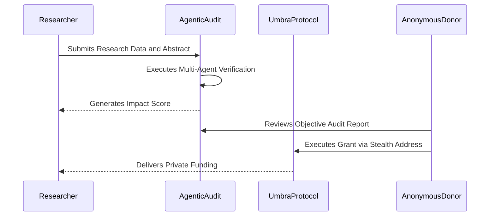

# Biotry: The Private Research Economy on Solana

Biotry is an integrated scientific liquidity and privacy protocol designed to bridge the gap between breakthrough research and decentralized capital. By combining high-performance computing on Solana with **Umbra-powered stealth addresses**, Biotry creates a trustless environment for the anonymous funding, audit, and publication of the next generation of human knowledge.

---

## The Genesis of Scientific Stagnation: Identity Bias

The modern scientific endeavor is restricted by a centralized, gate-kept model of funding where **Reputation Bias** outweighs actual methodology. Researchers spend forty percent of their time drafting grant applications that are reviewed by competitors, while donors avoid sensitive fields to prevent strategic interests from being exposed on public ledgers. This transparency paradox has led to a stagnation in high-risk research.

## The Biotry Thesis: Sovereign Discovery

Biotry addresses these challenges through a privacy-native protocol design:
1. **Anonymous Grants (Umbra)**: Utilize stealth addresses to sever the public link between the funding source and the researcher, eliminating identity-based bias.
2. **AI Research Simulator**: A war room of five specialized AI agents provide instant, objective audits of research viability.
3. **Discovery Mesh (Tapestry)**: An expertise-weighted reputation graph that maps scientific authority without compromising financial privacy.

## Project Architecture

Biotry serves as a comprehensive ecosystem for the entire research lifecycle:
- **Stealth Funding Layer**: Powered by the **Umbra Privacy Engine**, allowing philanthropists and institutions to fund discovery without public exposure.
- **AI Audit Engine**: Predicted viability scores across 5 specialized domains (Dr. Bio, Solana Arch, ZK Shadow, Codama, Strategist).
- **Expertise Graph**: Powered by **Tapestry**, mapping citations and credits into a liquid trust network.

## Implementation Deep-Links

The following represent the core protocol implementations:

### [Privacy-First Funding Layer (Umbra)](src/components/DeSciDashboard.tsx)
Implementation of the stealth transfer flow for anonymous research grants.

### [AI Research Simulator (Agentic War Room)](src/pages/SimulatePage.tsx)
Multi-agent consensus engine for objective methodology verification.

### [Social Discovery Mesh (Tapestry)](src/lib/tapestry.ts)
Weighted reputation and citation mapping for verified scientific identity.

## Operational Sequence: Anonymous Funding

## Protocol Roadmap

**Phase 01: Privacy Foundation (Current)**
- Integration of Umbra Core for Anonymous Research Grants.
- Deployment of the AI Audit Engine on Solana Devnet.
- Tapestry Social Graph integration for researcher identity.

**Phase 02: Intelligence Layer**
- Stealth Milestone Payments (Privacy-preserved payout cycles).
- Automated Grant Scoring based on agentic consensus.

**Phase 03: The Sovereign Mesh**
- Private Peer Review rewards via stealth settlement.
- Global Reputation Staking and predictive research markets.

---
Copyright 2026 Biotry Systems // Privacy-Native Scientific Infrastructure on Solana
